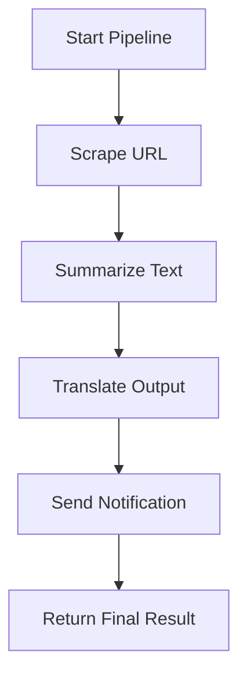

# 🔄 AI Workflow Orchestrator

## Table of Contents
- [Project Overview](#-ai-workflow-orchestrator)
- [Why I Built This](#-why-i-built-this)
- [What Problem It Solves](#-what-problem-it-solves)
- [Features](#️-features)
  - [Modular Workflow Steps](#-modular-workflow-steps)
  - [API-Based Execution](#-api-based-execution)
  - [Pipeline Storage](#-pipeline-storage)
  - [Extensible](#-extensible)
  - [Built With](#-built-with)
- [How It Works](#-how-it-works)
- [Setup Instructions](#-setup-instructions)
  - [Clone the Repo](#1️⃣-clone-the-repo)
  - [Create Virtual Environment](#2️⃣-create-virtual-environment)
  - [Install Requirements](#3️⃣-install-requirements)
  - [Run Django Server](#4️⃣-run-django-server)
  - [Run Your Pipeline](#5️⃣-run-your-pipeline)
- [Future Enhancements](#-future-enhancements)
- [Why This Project Is Special](#-why-this-project-is-special)

---

A modular and extensible platform that lets users create automated **AI-powered workflows** such as:

**Scrape → Summarize → Translate → Notify**

This project brings together **AI**, **automation**, and **backend engineering** into a single system that executes multi-step pipelines—similar to a simplified version of Zapier or LangChain Agents, but built entirely from scratch using technologies like **Django**, **Python**, **requests**, and **LLM APIs**.

---

## 📌 Why I Built This
Modern AI tools are powerful, but users often repeat the same tasks manually:

- Scraping the same websites  
- Summarizing long text  
- Translating content  
- Sending output through WhatsApp/SMS  
- Running multi-step processes daily  

There was *no simple system* to automate these steps or chain them together without writing repeated code each time.

So I built a **workflow engine** where anyone can run multi-step AI tasks with just one click.

---

## 🎯 What Problem It Solves
This project solves 3 major problems:

### 1. ❌ Repetitive Manual Tasks  
Users no longer need to scrape text, summarize it, and translate it manually each time.

### 2. ❌ No way to chain AI tasks  
Most AI tools only do **one task** (e.g., summarization).  
This system lets you **combine** tasks like:

- Scrape a website  
- Summarize content  
- Translate summary  
- Send result to WhatsApp/SMS  

### 3. ❌ No simple automation engine  
Businesses and developers lack an easy way to automate data workflows using AI.

---

## ⚙️ Features

### 🧩 Modular Workflow Steps
Currently supports:
- **Web Scraping**
- **AI Summarization**
- **Translation**
- **Notification (WhatsApp/SMS/Email)**

### ⚡ API-Based Execution
Each pipeline is executed via a single API call:

### 🗄 Pipeline Storage
All pipelines are stored in the database:
- Steps  
- Order  
- Config  
- Execution details  

### 🔌 Extensible
You can easily add steps like:
- Sentiment Analysis  
- Keyword Extraction  
- File Generation  
- PDF Report Creation  
- Slack Notifications  
- Google Sheets Logging  

### 🛠 Built With
- **Django** (Backend + API)
- **Python** (Scraping, AI calls)
- **Requests**
- **BeautifulSoup**
- **LLM APIs (Gemini/OpenAI/HuggingFace)**
- **Twilio (SMS/WhatsApp)** (optional future integration)

---

## 🚀 How It Works

### Example Pipeline  
1. Scrape webpage content

2. Summarize the scraped text using an LLM

3. Translate the summary to user’s preferred language

4. Send final output through WhatsApp/SMS/Email

### Execution Flow

---
### 🖼️ UI Preview

